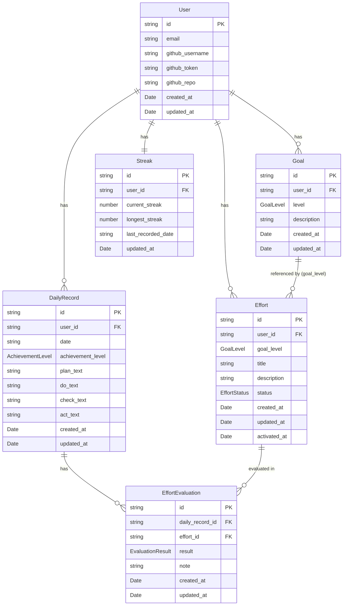

# データモデル定義書

## 概要
本ドキュメントでは、学習管理アプリケーションで使用するすべてのエンティティのデータ構造を定義します。

**永続化方法**: Supabase（PostgreSQL）
**リレーションシップ**: 外部キー制約を使用してデータ整合性を保証

---

## エンティティ一覧

### 1. User（ユーザー）

ユーザーの基本情報とGitHub連携設定を管理します。

#### TypeScript型定義

```typescript
interface User {
  id: string;                    // UUID（Supabase Auth User ID）
  email: string;                 // メールアドレス
  created_at: Date;              // アカウント作成日時
  updated_at: Date;              // 最終更新日時

  // GitHub連携設定
  github_username?: string;      // GitHubユーザー名
  github_token?: string;         // Personal Access Token（暗号化保存推奨）
  github_repo?: string;          // リポジトリ名（例: "owner/repo"）
}
```

#### フィールド詳細

| フィールド名 | 型 | 必須 | デフォルト値 | バリデーション |
|------------|-----|------|------------|--------------|
| `id` | string (UUID) | ✓ | - | Supabase Auth自動生成 |
| `email` | string | ✓ | - | メール形式 |
| `created_at` | Date | ✓ | 現在時刻 | - |
| `updated_at` | Date | ✓ | 現在時刻 | 更新時に自動更新 |
| `github_username` | string | - | null | 1-39文字（GitHub仕様） |
| `github_token` | string | - | null | 暗号化保存必須 |
| `github_repo` | string | - | null | "owner/repo" 形式 |

---

### 2. Goal（目標）

Bronze/Silver/Goldの3レベルの目標を管理します。

#### TypeScript型定義

```typescript
type GoalLevel = 'bronze' | 'silver' | 'gold';

interface Goal {
  id: string;                    // UUID
  user_id: string;               // 外部キー: User.id
  level: GoalLevel;              // 目標レベル
  description: string;           // 目標内容
  created_at: Date;              // 作成日時
  updated_at: Date;              // 最終更新日時
}
```

#### フィールド詳細

| フィールド名 | 型 | 必須 | デフォルト値 | バリデーション |
|------------|-----|------|------------|--------------|
| `id` | string (UUID) | ✓ | - | 自動生成 |
| `user_id` | string (UUID) | ✓ | - | 外部キー制約（User.id） |
| `level` | GoalLevel | ✓ | - | 'bronze', 'silver', 'gold' のいずれか |
| `description` | string | ✓ | - | 1-500文字 |
| `created_at` | Date | ✓ | 現在時刻 | - |
| `updated_at` | Date | ✓ | 現在時刻 | 更新時に自動更新 |

#### 制約

- 1ユーザーにつき各レベル1つずつ（合計3つ）の目標を持つ
- UNIQUE制約: `(user_id, level)`

---

### 3. Effort（工夫）

各目標レベルに紐づく工夫を管理します。

#### TypeScript型定義

```typescript
type EffortStatus = 'active' | 'archived';

interface Effort {
  id: string;                    // UUID
  user_id: string;               // 外部キー: User.id
  goal_level: GoalLevel;         // 対象目標レベル（bronze/silver/gold）
  title: string;                 // 工夫のタイトル
  description?: string;          // 工夫の詳細説明
  status: EffortStatus;          // ステータス
  created_at: Date;              // 作成日時
  updated_at: Date;              // 最終更新日時
  activated_at?: Date;           // active化された日時（最初にactiveになった日）
}
```

#### フィールド詳細

| フィールド名 | 型 | 必須 | デフォルト値 | バリデーション |
|------------|-----|------|------------|--------------|
| `id` | string (UUID) | ✓ | - | 自動生成 |
| `user_id` | string (UUID) | ✓ | - | 外部キー制約（User.id） |
| `goal_level` | GoalLevel | ✓ | - | 'bronze', 'silver', 'gold' のいずれか |
| `title` | string | ✓ | - | 1-200文字 |
| `description` | string | - | null | 0-1000文字 |
| `status` | EffortStatus | ✓ | 'active' | 'active' または 'archived' |
| `created_at` | Date | ✓ | 現在時刻 | - |
| `updated_at` | Date | ✓ | 現在時刻 | 更新時に自動更新 |
| `activated_at` | Date | - | null | status='active'時に設定 |

#### ステータスの説明

- **active**: 現在使用中の工夫。記録画面で評価対象となる。
- **archived**: アーカイブ済み。通常は表示されないが、履歴として保持。

#### リレーションシップ

- 工夫は**レベルごとに独立した管理**を行う
- Bronze用の工夫リスト、Silver用の工夫リスト、Gold用の工夫リストを完全に分離
- 同じタイトルの工夫を複数レベルで作成することも可能（重複登録可）

---

### 4. DailyRecord（日次記録）

毎日のPLAN/DO/CHECK/ACTと達成レベルを記録します。

#### TypeScript型定義

```typescript
type AchievementLevel = 'none' | 'bronze' | 'silver' | 'gold';

interface DailyRecord {
  id: string;                    // UUID
  user_id: string;               // 外部キー: User.id
  date: string;                  // 記録日（YYYY-MM-DD形式）
  achievement_level: AchievementLevel; // 達成レベル

  // PDCA各ステップの内容
  plan_text?: string;            // PLANステップの記録
  do_text?: string;              // DOステップの記録
  check_text?: string;           // CHECKステップの記録
  act_text?: string;             // ACTステップの記録

  created_at: Date;              // 作成日時
  updated_at: Date;              // 最終更新日時
}
```

#### フィールド詳細

| フィールド名 | 型 | 必須 | デフォルト値 | バリデーション |
|------------|-----|------|------------|--------------|
| `id` | string (UUID) | ✓ | - | 自動生成 |
| `user_id` | string (UUID) | ✓ | - | 外部キー制約（User.id） |
| `date` | string | ✓ | - | YYYY-MM-DD形式、UNIQUE制約（user_id, date） |
| `achievement_level` | AchievementLevel | ✓ | 'none' | 'none', 'bronze', 'silver', 'gold' のいずれか |
| `plan_text` | string | - | null | 最大5000文字 |
| `do_text` | string | - | null | 最大5000文字 |
| `check_text` | string | - | null | 最大5000文字 |
| `act_text` | string | - | null | 最大5000文字 |
| `created_at` | Date | ✓ | 現在時刻 | - |
| `updated_at` | Date | ✓ | 現在時刻 | 更新時に自動更新 |

#### 制約

- UNIQUE制約: `(user_id, date)` — 1日1レコードのみ
- 日付の重複が発生した場合: 最新の`updated_at`を持つレコードを採用

---

### 5. EffortEvaluation（工夫の評価）

日次記録において、各工夫の効果を評価します。

#### TypeScript型定義

```typescript
type EvaluationResult = 'effective' | 'not_effective' | 'not_applicable';

interface EffortEvaluation {
  id: string;                    // UUID
  daily_record_id: string;       // 外部キー: DailyRecord.id
  effort_id: string;             // 外部キー: Effort.id
  result: EvaluationResult;      // 評価結果
  note?: string;                 // 評価メモ
  created_at: Date;              // 作成日時
  updated_at: Date;              // 最終更新日時
}
```

#### フィールド詳細

| フィールド名 | 型 | 必須 | デフォルト値 | バリデーション |
|------------|-----|------|------------|--------------|
| `id` | string (UUID) | ✓ | - | 自動生成 |
| `daily_record_id` | string (UUID) | ✓ | - | 外部キー制約（DailyRecord.id, ON DELETE CASCADE） |
| `effort_id` | string (UUID) | ✓ | - | 外部キー制約（Effort.id） |
| `result` | EvaluationResult | ✓ | - | 'effective', 'not_effective', 'not_applicable' のいずれか |
| `note` | string | - | null | 最大500文字 |
| `created_at` | Date | ✓ | 現在時刻 | - |
| `updated_at` | Date | ✓ | 現在時刻 | 更新時に自動更新 |

#### 評価結果の説明

- **effective**: 効果あり
- **not_effective**: 効果なし
- **not_applicable**: 該当なし（その日は使用しなかった）

#### 制約

- UNIQUE制約: `(daily_record_id, effort_id)` — 1日1工夫につき1評価のみ

---

### 6. Streak（ストリーク情報）

連続記録日数を管理します。

#### TypeScript型定義

```typescript
interface Streak {
  id: string;                    // UUID
  user_id: string;               // 外部キー: User.id
  current_streak: number;        // 現在の連続日数
  longest_streak: number;        // 過去最高連続日数
  last_recorded_date?: string;   // 最後に記録した日（YYYY-MM-DD形式）
  updated_at: Date;              // 最終更新日時
}
```

#### フィールド詳細

| フィールド名 | 型 | 必須 | デフォルト値 | バリデーション |
|------------|-----|------|------------|--------------|
| `id` | string (UUID) | ✓ | - | 自動生成 |
| `user_id` | string (UUID) | ✓ | - | 外部キー制約（User.id）、UNIQUE |
| `current_streak` | number | ✓ | 0 | 0以上の整数 |
| `longest_streak` | number | ✓ | 0 | 0以上の整数 |
| `last_recorded_date` | string | - | null | YYYY-MM-DD形式 |
| `updated_at` | Date | ✓ | 現在時刻 | 更新時に自動更新 |

#### ストリークカウントの定義

- **カウント対象**: Bronze以上（Bronze, Silver, Gold のいずれか）を達成した日
- **リセット条件**: 1日でも記録なし、またはBronze未達成（achievement_level='none'）の日があった場合、翌日カウントは0にリセット
- **日付判定**: ユーザーのブラウザローカル時刻を使用（23:59:59までに記録確定）

---

## エンティティ間のリレーションシップ（ERD）



---

## リレーションシップの詳細

### User → Goal
- **関係**: 1対多
- **説明**: 1ユーザーは各レベル1つずつ、合計3つの目標を持つ
- **外部キー**: `Goal.user_id` → `User.id`
- **削除時の動作**: `ON DELETE CASCADE`（ユーザー削除時に関連する目標も削除）

### User → Effort
- **関係**: 1対多
- **説明**: 1ユーザーは複数の工夫を持つ。工夫は各レベル（Bronze/Silver/Gold）ごとに独立して管理される
- **外部キー**: `Effort.user_id` → `User.id`
- **削除時の動作**: `ON DELETE CASCADE`

### Goal → Effort
- **関係**: 論理的な参照（外部キーなし）
- **説明**: `Effort.goal_level` が `Goal.level` を参照するが、直接的な外部キー制約は設定しない。レベルごとに工夫が分離されているため、アプリケーション層で整合性を管理。
- **注意**: Goal が存在しない level の Effort は表示しない（アプリ側で制御）

### User → DailyRecord
- **関係**: 1対多
- **説明**: 1ユーザーは複数の日次記録を持つ（1日1レコード）
- **外部キー**: `DailyRecord.user_id` → `User.id`
- **削除時の動作**: `ON DELETE CASCADE`

### DailyRecord → EffortEvaluation
- **関係**: 1対多
- **説明**: 1つの日次記録は複数の工夫評価を持つ
- **外部キー**: `EffortEvaluation.daily_record_id` → `DailyRecord.id`
- **削除時の動作**: `ON DELETE CASCADE`（日次記録削除時に関連する評価も削除）

### Effort → EffortEvaluation
- **関係**: 1対多
- **説明**: 1つの工夫は複数の日次記録で評価される
- **外部キー**: `EffortEvaluation.effort_id` → `Effort.id`
- **削除時の動作**: `ON DELETE RESTRICT`（評価が存在する工夫は削除不可。アーカイブを推奨）

### User → Streak
- **関係**: 1対1
- **説明**: 1ユーザーにつき1つのストリーク情報を持つ
- **外部キー**: `Streak.user_id` → `User.id` (UNIQUE制約)
- **削除時の動作**: `ON DELETE CASCADE`

---

## 特記事項

### 「改良して継続」を選択した場合の処理

工夫管理画面で「改良して継続」を選択した場合の処理方針:

- **同一IDで内容を上書き（履歴なし）**
- `Effort.title` および `Effort.description` を更新
- `Effort.updated_at` のみ更新される
- 過去の内容は保持されない（シンプルな実装）

### データ不整合時の挙動

以下のエッジケースに対する処理方針:

1. **工夫が参照する目標レベルが存在しない場合**
   - 該当工夫を表示せず、コンソールに警告ログ出力
   - データ修復機能は v1 では未実装

2. **日次記録の日付が重複している場合**
   - 最新の `updated_at` を持つレコードを採用
   - UNIQUE制約により通常は発生しないが、万一の場合の対応

3. **システム日付が過去に戻った場合**
   - 警告を表示し、記録を許可しない
   - タイムゾーン変更やデバイス時刻変更に対する防御

### 初回利用時のフロー

1. 初回アクセス時に「目標設定ウィザード」を表示
2. Bronze/Silver/Gold の3つの目標を入力させる
3. サンプルデータは提供せず、ユーザー自身で入力
4. 目標設定完了後、ホーム画面へ遷移

### データのバックアップ

- **v1では未実装**
- 将来的にJSON形式でのエクスポート/インポート機能を検討
- Supabase のバックアップ機能に依存

---

## Supabase テーブル定義（SQL例）

```sql
-- Users テーブル (Supabase Auth を使用するため、追加フィールドのみ)
CREATE TABLE user_settings (
  id UUID PRIMARY KEY REFERENCES auth.users(id) ON DELETE CASCADE,
  github_username TEXT,
  github_token TEXT, -- 暗号化推奨
  github_repo TEXT,
  created_at TIMESTAMPTZ DEFAULT NOW(),
  updated_at TIMESTAMPTZ DEFAULT NOW()
);

-- Goals テーブル
CREATE TABLE goals (
  id UUID PRIMARY KEY DEFAULT gen_random_uuid(),
  user_id UUID NOT NULL REFERENCES auth.users(id) ON DELETE CASCADE,
  level TEXT NOT NULL CHECK (level IN ('bronze', 'silver', 'gold')),
  description TEXT NOT NULL CHECK (char_length(description) BETWEEN 1 AND 500),
  created_at TIMESTAMPTZ DEFAULT NOW(),
  updated_at TIMESTAMPTZ DEFAULT NOW(),
  UNIQUE(user_id, level)
);

-- Efforts テーブル
CREATE TABLE efforts (
  id UUID PRIMARY KEY DEFAULT gen_random_uuid(),
  user_id UUID NOT NULL REFERENCES auth.users(id) ON DELETE CASCADE,
  goal_level TEXT NOT NULL CHECK (goal_level IN ('bronze', 'silver', 'gold')),
  title TEXT NOT NULL CHECK (char_length(title) BETWEEN 1 AND 200),
  description TEXT CHECK (char_length(description) <= 1000),
  status TEXT NOT NULL DEFAULT 'active' CHECK (status IN ('active', 'archived')),
  created_at TIMESTAMPTZ DEFAULT NOW(),
  updated_at TIMESTAMPTZ DEFAULT NOW(),
  activated_at TIMESTAMPTZ
);

-- Daily Records テーブル
CREATE TABLE daily_records (
  id UUID PRIMARY KEY DEFAULT gen_random_uuid(),
  user_id UUID NOT NULL REFERENCES auth.users(id) ON DELETE CASCADE,
  date DATE NOT NULL,
  achievement_level TEXT NOT NULL DEFAULT 'none' CHECK (achievement_level IN ('none', 'bronze', 'silver', 'gold')),
  plan_text TEXT CHECK (char_length(plan_text) <= 5000),
  do_text TEXT CHECK (char_length(do_text) <= 5000),
  check_text TEXT CHECK (char_length(check_text) <= 5000),
  act_text TEXT CHECK (char_length(act_text) <= 5000),
  created_at TIMESTAMPTZ DEFAULT NOW(),
  updated_at TIMESTAMPTZ DEFAULT NOW(),
  UNIQUE(user_id, date)
);

-- Effort Evaluations テーブル
CREATE TABLE effort_evaluations (
  id UUID PRIMARY KEY DEFAULT gen_random_uuid(),
  daily_record_id UUID NOT NULL REFERENCES daily_records(id) ON DELETE CASCADE,
  effort_id UUID NOT NULL REFERENCES efforts(id) ON DELETE RESTRICT,
  result TEXT NOT NULL CHECK (result IN ('effective', 'not_effective', 'not_applicable')),
  note TEXT CHECK (char_length(note) <= 500),
  created_at TIMESTAMPTZ DEFAULT NOW(),
  updated_at TIMESTAMPTZ DEFAULT NOW(),
  UNIQUE(daily_record_id, effort_id)
);

-- Streaks テーブル
CREATE TABLE streaks (
  id UUID PRIMARY KEY DEFAULT gen_random_uuid(),
  user_id UUID NOT NULL REFERENCES auth.users(id) ON DELETE CASCADE UNIQUE,
  current_streak INTEGER NOT NULL DEFAULT 0 CHECK (current_streak >= 0),
  longest_streak INTEGER NOT NULL DEFAULT 0 CHECK (longest_streak >= 0),
  last_recorded_date DATE,
  updated_at TIMESTAMPTZ DEFAULT NOW()
);

-- 自動更新トリガー (updated_at)
CREATE OR REPLACE FUNCTION update_updated_at_column()
RETURNS TRIGGER AS $$
BEGIN
  NEW.updated_at = NOW();
  RETURN NEW;
END;
$$ LANGUAGE plpgsql;

CREATE TRIGGER update_user_settings_updated_at BEFORE UPDATE ON user_settings FOR EACH ROW EXECUTE FUNCTION update_updated_at_column();
CREATE TRIGGER update_goals_updated_at BEFORE UPDATE ON goals FOR EACH ROW EXECUTE FUNCTION update_updated_at_column();
CREATE TRIGGER update_efforts_updated_at BEFORE UPDATE ON efforts FOR EACH ROW EXECUTE FUNCTION update_updated_at_column();
CREATE TRIGGER update_daily_records_updated_at BEFORE UPDATE ON daily_records FOR EACH ROW EXECUTE FUNCTION update_updated_at_column();
CREATE TRIGGER update_effort_evaluations_updated_at BEFORE UPDATE ON effort_evaluations FOR EACH ROW EXECUTE FUNCTION update_updated_at_column();
CREATE TRIGGER update_streaks_updated_at BEFORE UPDATE ON streaks FOR EACH ROW EXECUTE FUNCTION update_updated_at_column();
```

---

## 参照元

このデータモデルは [requirements.md](./requirements.md) で定義されている機能要件に基づいて設計されています。
