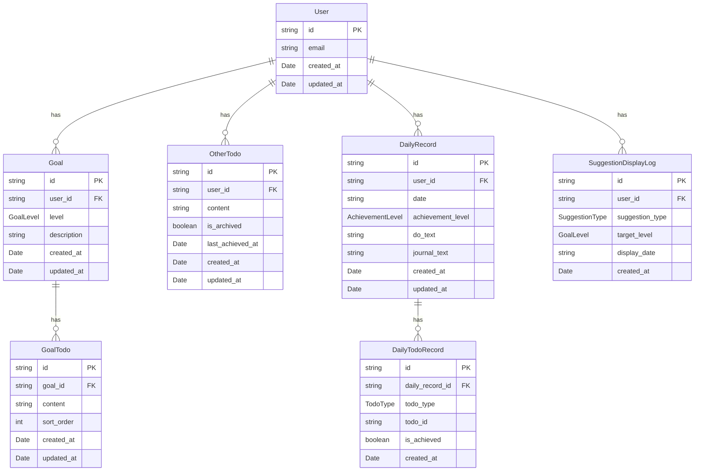

# データモデル定義書（MVP版）

## 概要
本ドキュメントでは、学習管理アプリケーション（MVP版）で使用するすべてのエンティティのデータ構造を定義します。

**永続化方法**: Supabase（PostgreSQL）
**リレーションシップ**: 外部キー制約を使用してデータ整合性を保証

**注意**: 工夫管理機能（Effort/EffortEvaluation）は将来の拡張機能として [future-features.md](./future-features.md) に記載されています。MVP版では実装しません。

---

## エンティティ一覧

### 1. User（ユーザー）

ユーザーの基本情報を管理します。

#### TypeScript型定義

```typescript
interface User {
  id: string;                    // UUID（Supabase Auth User ID）
  email: string;                 // メールアドレス
  created_at: Date;              // アカウント作成日時
  updated_at: Date;              // 最終更新日時
}
```

#### フィールド詳細

| フィールド名 | 型 | 必須 | デフォルト値 | バリデーション |
|------------|-----|------|------------|--------------|
| `id` | string (UUID) | ✓ | - | Supabase Auth自動生成 |
| `email` | string | ✓ | - | メール形式 |
| `created_at` | Date | ✓ | 現在時刻 | - |
| `updated_at` | Date | ✓ | 現在時刻 | 更新時に自動更新 |

---

### 2. Goal（目標）

Bronze/Silver/Goldの3レベルの目標を管理します。

#### TypeScript型定義

```typescript
type GoalLevel = 'bronze' | 'silver' | 'gold';

interface Goal {
  id: string;                    // UUID
  user_id: string;               // 外部キー: User.id
  level: GoalLevel;              // 目標レベル
  description: string;           // 目標内容（廃止予定：後方互換性のため残存）
  created_at: Date;              // 作成日時
  updated_at: Date;              // 最終更新日時
}
```

#### フィールド詳細

| フィールド名 | 型 | 必須 | デフォルト値 | バリデーション |
|------------|-----|------|------------|--------------|
| `id` | string (UUID) | ✓ | - | 自動生成 |
| `user_id` | string (UUID) | ✓ | - | 外部キー制約（User.id） |
| `level` | GoalLevel | ✓ | - | 'bronze', 'silver', 'gold' のいずれか |
| `description` | string | - | null | **廃止予定**。1-500文字。移行後は`goal_todos`を使用 |
| `created_at` | Date | ✓ | 現在時刻 | - |
| `updated_at` | Date | ✓ | 現在時刻 | 更新時に自動更新 |

#### 制約

- 1ユーザーにつき各レベル1つずつ（合計3つ）の目標を持つ
- UNIQUE制約: `(user_id, level)`

#### 備考

- `description`フィールドは廃止予定。新規登録では使用せず、`goal_todos`テーブルを使用する
- 既存データ移行後、`description`はNULL許可に変更

---

### 3. GoalTodo（目標TODO）

各目標（Gold/Silver/Bronze）に紐づくTODOを管理します。

#### TypeScript型定義

```typescript
interface GoalTodo {
  id: string;                    // UUID
  goal_id: string;               // 外部キー: Goal.id
  content: string;               // TODO内容
  sort_order: number;            // 表示順（追加順）
  created_at: Date;              // 作成日時
  updated_at: Date;              // 最終更新日時
}
```

#### フィールド詳細

| フィールド名 | 型 | 必須 | デフォルト値 | バリデーション |
|------------|-----|------|------------|--------------|
| `id` | string (UUID) | ✓ | - | 自動生成 |
| `goal_id` | string (UUID) | ✓ | - | 外部キー制約（Goal.id） |
| `content` | string | ✓ | - | 1-500文字 |
| `sort_order` | number | ✓ | 0 | 0以上の整数 |
| `created_at` | Date | ✓ | 現在時刻 | - |
| `updated_at` | Date | ✓ | 現在時刻 | 更新時に自動更新 |

#### 制約

- 1つの目標（Goal）に対して複数のTODOを持てる（上限なし）
- 各目標には最低1つのTODOが必要（アプリケーション側でバリデーション）

---

### 4. OtherTodo（その他TODO）

「その他」カテゴリのTODOを管理します。目標レベル（Gold/Silver/Bronze）とは独立して、日々の達成項目を記録できます。

#### TypeScript型定義

```typescript
interface OtherTodo {
  id: string;                    // UUID
  user_id: string;               // 外部キー: User.id
  content: string;               // TODO内容
  is_archived: boolean;          // アーカイブ状態
  last_achieved_at?: Date;       // 最後に達成した日時
  created_at: Date;              // 作成日時
  updated_at: Date;              // 最終更新日時
}
```

#### フィールド詳細

| フィールド名 | 型 | 必須 | デフォルト値 | バリデーション |
|------------|-----|------|------------|--------------|
| `id` | string (UUID) | ✓ | - | 自動生成 |
| `user_id` | string (UUID) | ✓ | - | 外部キー制約（User.id） |
| `content` | string | ✓ | - | 1-500文字 |
| `is_archived` | boolean | ✓ | false | true/false |
| `last_achieved_at` | Date | - | null | 達成時に更新 |
| `created_at` | Date | ✓ | 現在時刻 | - |
| `updated_at` | Date | ✓ | 現在時刻 | 更新時に自動更新 |

#### 特徴

- 達成度（Bronze/Silver/Gold）の判定には**影響しない**
- 一度登録したTODOは次回以降の日報登録でも表示される（永続化）
- `is_archived = true`のTODOは日報登録画面で非表示
- 表示順は`last_achieved_at`降順（最後に達成した日付順）
- 同名のTODOを入力した場合、アーカイブ済みなら復活（`is_archived = false`に更新）

---

### 5. DailyRecord（日次記録）

毎日の学習内容と達成レベルを記録します。

#### TypeScript型定義

```typescript
type AchievementLevel = 'none' | 'bronze' | 'silver' | 'gold';

interface DailyRecord {
  id: string;                    // UUID
  user_id: string;               // 外部キー: User.id
  date: string;                  // 記録日（YYYY-MM-DD形式）
  achievement_level: AchievementLevel; // 達成レベル

  // 記録内容
  do_text?: string;              // 学習内容サマリー（廃止予定）
  journal_text?: string;         // 自由記述（Journal）

  created_at: Date;              // 作成日時
  updated_at: Date;              // 最終更新日時
}
```

#### フィールド詳細

| フィールド名 | 型 | 必須 | デフォルト値 | バリデーション |
|------------|-----|------|------------|--------------|
| `id` | string (UUID) | ✓ | - | 自動生成 |
| `user_id` | string (UUID) | ✓ | - | 外部キー制約（User.id） |
| `date` | string | ✓ | - | YYYY-MM-DD形式、UNIQUE制約（user_id, date） |
| `achievement_level` | AchievementLevel | ✓ | 'none' | 'none', 'bronze', 'silver', 'gold' のいずれか |
| `do_text` | string | - | null | **廃止予定**。最大5000文字。移行後は`daily_todo_records`を使用 |
| `journal_text` | string | - | null | 最大5000文字。自由記述（感想や気づき） |
| `created_at` | Date | ✓ | 現在時刻 | - |
| `updated_at` | Date | ✓ | 現在時刻 | 更新時に自動更新 |

#### フィールドの使用状況

**do_text（学習内容サマリー）:**
- **廃止予定**。新規登録では使用しない
- 既存データは移行時に`other_todos`と`daily_todo_records`へ変換

**journal_text（自由記述）:**
- 記録画面で入力
- 今日感じたことや気づきなどを自由に記述
- ホーム画面のカードで冒頭100文字程度が表示される

#### 制約

- UNIQUE制約: `(user_id, date)` — 1日1レコードのみ
- 日付の重複が発生した場合: 最新の`updated_at`を持つレコードを採用

---

### 6. DailyTodoRecord（日次TODO達成記録）

各日のTODO達成状態を記録します。

#### TypeScript型定義

```typescript
type TodoType = 'goal' | 'other';

interface DailyTodoRecord {
  id: string;                    // UUID
  daily_record_id: string;       // 外部キー: DailyRecord.id
  todo_type: TodoType;           // TODOの種類
  todo_id: string;               // goal_todos.id または other_todos.id
  is_achieved: boolean;          // 達成状態
  created_at: Date;              // 作成日時
}
```

#### フィールド詳細

| フィールド名 | 型 | 必須 | デフォルト値 | バリデーション |
|------------|-----|------|------------|--------------|
| `id` | string (UUID) | ✓ | - | 自動生成 |
| `daily_record_id` | string (UUID) | ✓ | - | 外部キー制約（DailyRecord.id） |
| `todo_type` | TodoType | ✓ | - | 'goal' または 'other' |
| `todo_id` | string (UUID) | ✓ | - | goal_todos.id または other_todos.id |
| `is_achieved` | boolean | ✓ | false | true/false |
| `created_at` | Date | ✓ | 現在時刻 | - |

#### 制約

- UNIQUE制約: `(daily_record_id, todo_type, todo_id)` — 同じ日の同じTODOは1レコードのみ

#### 用途

- 各日にどのTODOを達成したかを記録
- `todo_type = 'goal'`の場合、`todo_id`は`goal_todos.id`を参照
- `todo_type = 'other'`の場合、`todo_id`は`other_todos.id`を参照
- ホーム画面のカード表示や日詳細画面での達成TODO一覧表示に使用

---

### 7. SuggestionDisplayLog（提案バナー表示履歴）

提案バナーの表示履歴を記録し、同日の重複表示を防ぎます。

#### TypeScript型定義

```typescript
type SuggestionType = 'level_up' | 'level_down';

interface SuggestionDisplayLog {
  id: string;                    // UUID
  user_id: string;               // 外部キー: User.id
  suggestion_type: SuggestionType; // 提案種別
  target_level?: GoalLevel;      // 対象レベル（level_upの場合のみ）
  display_date: string;          // 表示日（YYYY-MM-DD形式）
  created_at: Date;              // 記録作成日時
}
```

#### フィールド詳細

| フィールド名 | 型 | 必須 | デフォルト値 | バリデーション |
|------------|-----|------|------------|--------------|
| `id` | string (UUID) | ✓ | - | 自動生成 |
| `user_id` | string (UUID) | ✓ | - | 外部キー制約（User.id） |
| `suggestion_type` | SuggestionType | ✓ | - | 'level_up', 'level_down' のいずれか |
| `target_level` | GoalLevel | - | null | 'bronze', 'silver', 'gold' のいずれか（level_upの場合のみ） |
| `display_date` | string | ✓ | - | YYYY-MM-DD形式 |
| `created_at` | Date | ✓ | 現在時刻 | - |

#### 制約

- UNIQUE制約: `(user_id, suggestion_type, target_level, display_date)` — 同じ日に同じ提案は1回のみ記録
- インデックス: `(user_id, display_date)` — 検索性能向上

#### 用途

- 提案バナーを「その日限り」の表示にするための記録テーブル
- 条件を満たした日に提案バナーを表示し、記録を残す
- 同じ日に再度ページを訪れた場合、記録があれば提案バナーを表示しない
- 日付が変わったら記録がないため、再度条件を満たせば提案バナーを表示

---

## エンティティ間のリレーションシップ（ERD）



---

## リレーションシップの詳細

### User → Goal
- **関係**: 1対多
- **説明**: 1ユーザーは各レベル1つずつ、合計3つの目標を持つ
- **外部キー**: `Goal.user_id` → `User.id`
- **削除時の動作**: `ON DELETE CASCADE`（ユーザー削除時に関連する目標も削除）

### Goal → GoalTodo
- **関係**: 1対多
- **説明**: 1つの目標は複数のTODOを持つ（上限なし、最低1つ必要）
- **外部キー**: `GoalTodo.goal_id` → `Goal.id`
- **削除時の動作**: `ON DELETE CASCADE`（目標削除時に関連するTODOも削除）

### User → OtherTodo
- **関係**: 1対多
- **説明**: 1ユーザーは複数の「その他」TODOを持つ
- **外部キー**: `OtherTodo.user_id` → `User.id`
- **削除時の動作**: `ON DELETE CASCADE`

### User → DailyRecord
- **関係**: 1対多
- **説明**: 1ユーザーは複数の日次記録を持つ（1日1レコード）
- **外部キー**: `DailyRecord.user_id` → `User.id`
- **削除時の動作**: `ON DELETE CASCADE`

### DailyRecord → DailyTodoRecord
- **関係**: 1対多
- **説明**: 1つの日次記録は複数のTODO達成記録を持つ
- **外部キー**: `DailyTodoRecord.daily_record_id` → `DailyRecord.id`
- **削除時の動作**: `ON DELETE CASCADE`（日次記録削除時に関連するTODO達成記録も削除）

### User → SuggestionDisplayLog
- **関係**: 1対多
- **説明**: 1ユーザーは複数の提案バナー表示履歴を持つ
- **外部キー**: `SuggestionDisplayLog.user_id` → `User.id`
- **削除時の動作**: `ON DELETE CASCADE`

---

## 特記事項

### データ不整合時の挙動

以下のエッジケースに対する処理方針:

1. **日次記録の日付が重複している場合**
   - 最新の `updated_at` を持つレコードを採用
   - UNIQUE制約により通常は発生しないが、万一の場合の対応

2. **システム日付が過去に戻った場合**
   - 警告を表示し、記録を許可しない
   - タイムゾーン変更やデバイス時刻変更に対する防御

### 初回利用時のフロー

1. 初回アクセス時に「目標設定ウィザード」を表示
2. Bronze/Silver/Gold の3つの目標を入力させる
3. サンプルデータは提供せず、ユーザー自身で入力
4. 目標設定完了後、ホーム画面へ遷移

### データのバックアップ

- **v1では未実装**
- 将来的にJSON形式でのエクスポート/インポート機能を検討
- Supabase のバックアップ機能に依存

---

## Supabase テーブル定義（SQL例）

```sql
-- Users テーブル (Supabase Auth を使用するため、追加フィールドのみ)
CREATE TABLE user_settings (
  id UUID PRIMARY KEY REFERENCES auth.users(id) ON DELETE CASCADE,
  created_at TIMESTAMPTZ DEFAULT NOW(),
  updated_at TIMESTAMPTZ DEFAULT NOW()
);

-- Goals テーブル
CREATE TABLE goals (
  id UUID PRIMARY KEY DEFAULT gen_random_uuid(),
  user_id UUID NOT NULL REFERENCES auth.users(id) ON DELETE CASCADE,
  level TEXT NOT NULL CHECK (level IN ('bronze', 'silver', 'gold')),
  description TEXT CHECK (char_length(description) <= 500), -- 廃止予定、NULL許可に変更
  created_at TIMESTAMPTZ DEFAULT NOW(),
  updated_at TIMESTAMPTZ DEFAULT NOW(),
  UNIQUE(user_id, level)
);

-- Goal Todos テーブル（新規）
CREATE TABLE goal_todos (
  id UUID PRIMARY KEY DEFAULT gen_random_uuid(),
  goal_id UUID NOT NULL REFERENCES goals(id) ON DELETE CASCADE,
  content TEXT NOT NULL CHECK (char_length(content) BETWEEN 1 AND 500),
  sort_order INTEGER NOT NULL DEFAULT 0,
  created_at TIMESTAMPTZ DEFAULT NOW(),
  updated_at TIMESTAMPTZ DEFAULT NOW()
);

CREATE INDEX idx_goal_todos_goal_id ON goal_todos(goal_id);

-- Other Todos テーブル（新規）
CREATE TABLE other_todos (
  id UUID PRIMARY KEY DEFAULT gen_random_uuid(),
  user_id UUID NOT NULL REFERENCES auth.users(id) ON DELETE CASCADE,
  content TEXT NOT NULL CHECK (char_length(content) BETWEEN 1 AND 500),
  is_archived BOOLEAN NOT NULL DEFAULT FALSE,
  last_achieved_at TIMESTAMPTZ,
  created_at TIMESTAMPTZ DEFAULT NOW(),
  updated_at TIMESTAMPTZ DEFAULT NOW()
);

CREATE INDEX idx_other_todos_user_id ON other_todos(user_id);
CREATE INDEX idx_other_todos_user_archived ON other_todos(user_id, is_archived);

-- Daily Records テーブル
CREATE TABLE daily_records (
  id UUID PRIMARY KEY DEFAULT gen_random_uuid(),
  user_id UUID NOT NULL REFERENCES auth.users(id) ON DELETE CASCADE,
  date DATE NOT NULL,
  achievement_level TEXT NOT NULL DEFAULT 'none' CHECK (achievement_level IN ('none', 'bronze', 'silver', 'gold')),
  do_text TEXT CHECK (char_length(do_text) <= 5000), -- 廃止予定
  journal_text TEXT CHECK (char_length(journal_text) <= 5000),
  created_at TIMESTAMPTZ DEFAULT NOW(),
  updated_at TIMESTAMPTZ DEFAULT NOW(),
  UNIQUE(user_id, date)
);

-- Daily Todo Records テーブル（新規）
CREATE TABLE daily_todo_records (
  id UUID PRIMARY KEY DEFAULT gen_random_uuid(),
  daily_record_id UUID NOT NULL REFERENCES daily_records(id) ON DELETE CASCADE,
  todo_type TEXT NOT NULL CHECK (todo_type IN ('goal', 'other')),
  todo_id UUID NOT NULL,
  is_achieved BOOLEAN NOT NULL DEFAULT FALSE,
  created_at TIMESTAMPTZ DEFAULT NOW(),
  UNIQUE(daily_record_id, todo_type, todo_id)
);

CREATE INDEX idx_daily_todo_records_daily_record_id ON daily_todo_records(daily_record_id);

-- Suggestion Display Log テーブル
CREATE TABLE suggestion_display_log (
  id UUID PRIMARY KEY DEFAULT gen_random_uuid(),
  user_id UUID NOT NULL REFERENCES auth.users(id) ON DELETE CASCADE,
  suggestion_type TEXT NOT NULL CHECK (suggestion_type IN ('level_up', 'level_down')),
  target_level TEXT CHECK (target_level IN ('bronze', 'silver', 'gold')),
  display_date DATE NOT NULL,
  created_at TIMESTAMPTZ DEFAULT NOW(),
  UNIQUE(user_id, suggestion_type, target_level, display_date)
);

CREATE INDEX idx_suggestion_display_log_user_date ON suggestion_display_log(user_id, display_date);

-- 自動更新トリガー (updated_at)
CREATE OR REPLACE FUNCTION update_updated_at_column()
RETURNS TRIGGER AS $$
BEGIN
  NEW.updated_at = NOW();
  RETURN NEW;
END;
$$ LANGUAGE plpgsql;

CREATE TRIGGER update_user_settings_updated_at BEFORE UPDATE ON user_settings FOR EACH ROW EXECUTE FUNCTION update_updated_at_column();
CREATE TRIGGER update_goals_updated_at BEFORE UPDATE ON goals FOR EACH ROW EXECUTE FUNCTION update_updated_at_column();
CREATE TRIGGER update_goal_todos_updated_at BEFORE UPDATE ON goal_todos FOR EACH ROW EXECUTE FUNCTION update_updated_at_column();
CREATE TRIGGER update_other_todos_updated_at BEFORE UPDATE ON other_todos FOR EACH ROW EXECUTE FUNCTION update_updated_at_column();
CREATE TRIGGER update_daily_records_updated_at BEFORE UPDATE ON daily_records FOR EACH ROW EXECUTE FUNCTION update_updated_at_column();
```

---

## 参照元

このデータモデルは [requirements.md](./requirements.md) で定義されている機能要件に基づいて設計されています。

## 将来の拡張

工夫管理機能（Effort/EffortEvaluation エンティティ）の詳細については [future-features.md](./future-features.md) を参照してください。
