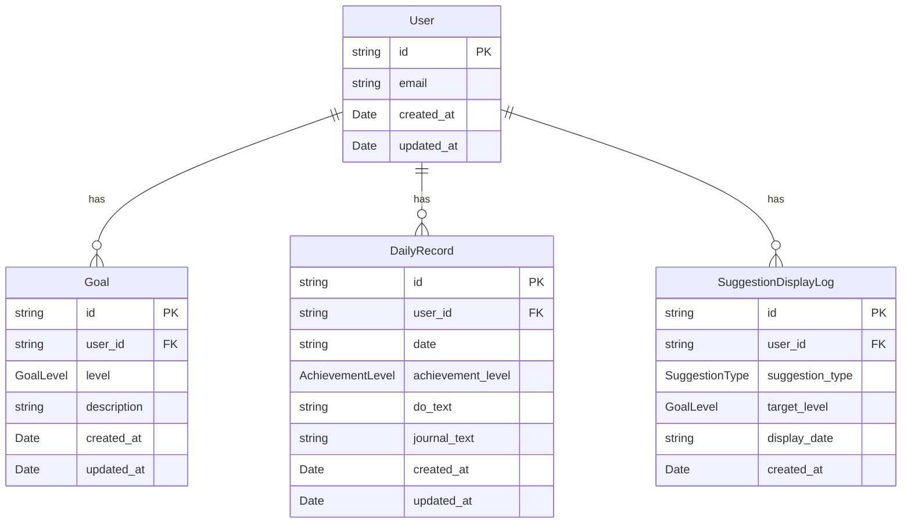

# データモデル定義書（MVP版）

## 概要
本ドキュメントでは、学習管理アプリケーション（MVP版）で使用するすべてのエンティティのデータ構造を定義します。

**永続化方法**: Supabase（PostgreSQL）
**リレーションシップ**: 外部キー制約を使用してデータ整合性を保証

**注意**: 工夫管理機能（Effort/EffortEvaluation）は将来の拡張機能として [future-features.md](./future-features.md) に記載されています。MVP版では実装しません。

---

## エンティティ一覧

### 1. User（ユーザー）

ユーザーの基本情報を管理します。

#### TypeScript型定義

```typescript
interface User {
  id: string;                    // UUID（Supabase Auth User ID）
  email: string;                 // メールアドレス
  created_at: Date;              // アカウント作成日時
  updated_at: Date;              // 最終更新日時
}
```

#### フィールド詳細

| フィールド名 | 型 | 必須 | デフォルト値 | バリデーション |
|------------|-----|------|------------|--------------|
| `id` | string (UUID) | ✓ | - | Supabase Auth自動生成 |
| `email` | string | ✓ | - | メール形式 |
| `created_at` | Date | ✓ | 現在時刻 | - |
| `updated_at` | Date | ✓ | 現在時刻 | 更新時に自動更新 |

---

### 2. Goal（目標）

Bronze/Silver/Goldの3レベルの目標を管理します。

#### TypeScript型定義

```typescript
type GoalLevel = 'bronze' | 'silver' | 'gold';

interface Goal {
  id: string;                    // UUID
  user_id: string;               // 外部キー: User.id
  level: GoalLevel;              // 目標レベル
  description: string;           // 目標内容
  created_at: Date;              // 作成日時
  updated_at: Date;              // 最終更新日時
}
```

#### フィールド詳細

| フィールド名 | 型 | 必須 | デフォルト値 | バリデーション |
|------------|-----|------|------------|--------------|
| `id` | string (UUID) | ✓ | - | 自動生成 |
| `user_id` | string (UUID) | ✓ | - | 外部キー制約（User.id） |
| `level` | GoalLevel | ✓ | - | 'bronze', 'silver', 'gold' のいずれか |
| `description` | string | ✓ | - | 1-500文字 |
| `created_at` | Date | ✓ | 現在時刻 | - |
| `updated_at` | Date | ✓ | 現在時刻 | 更新時に自動更新 |

#### 制約

- 1ユーザーにつき各レベル1つずつ（合計3つ）の目標を持つ
- UNIQUE制約: `(user_id, level)`

---

### 3. DailyRecord（日次記録）

毎日の学習内容と達成レベルを記録します。

#### TypeScript型定義

```typescript
type AchievementLevel = 'none' | 'bronze' | 'silver' | 'gold';

interface DailyRecord {
  id: string;                    // UUID
  user_id: string;               // 外部キー: User.id
  date: string;                  // 記録日（YYYY-MM-DD形式）
  achievement_level: AchievementLevel; // 達成レベル

  // 記録内容
  do_text?: string;              // 学習内容サマリー
  journal_text?: string;         // 自由記述（Journal）

  created_at: Date;              // 作成日時
  updated_at: Date;              // 最終更新日時
}
```

#### フィールド詳細

| フィールド名 | 型 | 必須 | デフォルト値 | バリデーション |
|------------|-----|------|------------|--------------|
| `id` | string (UUID) | ✓ | - | 自動生成 |
| `user_id` | string (UUID) | ✓ | - | 外部キー制約（User.id） |
| `date` | string | ✓ | - | YYYY-MM-DD形式、UNIQUE制約（user_id, date） |
| `achievement_level` | AchievementLevel | ✓ | 'none' | 'none', 'bronze', 'silver', 'gold' のいずれか |
| `do_text` | string | - | null | 最大5000文字。学習内容サマリー（箇条書き形式） |
| `journal_text` | string | - | null | 最大5000文字。自由記述（感想や気づき） |
| `created_at` | Date | ✓ | 現在時刻 | - |
| `updated_at` | Date | ✓ | 現在時刻 | 更新時に自動更新 |

#### フィールドの使用状況

**do_text（学習内容サマリー）:**
- 記録画面で入力
- 箇条書き形式で複数項目を記録
- ホーム画面のデイリーレポートカードに最大3件まで表示

**journal_text（自由記述）:**
- 記録画面で入力
- 今日感じたことや気づきなどを自由に記述
- ホーム画面のカードで冒頭100文字程度が表示される

#### 制約

- UNIQUE制約: `(user_id, date)` — 1日1レコードのみ
- 日付の重複が発生した場合: 最新の`updated_at`を持つレコードを採用

---

### 4. SuggestionDisplayLog（提案バナー表示履歴）

提案バナーの表示履歴を記録し、同日の重複表示を防ぎます。

#### TypeScript型定義

```typescript
type SuggestionType = 'level_up' | 'level_down';

interface SuggestionDisplayLog {
  id: string;                    // UUID
  user_id: string;               // 外部キー: User.id
  suggestion_type: SuggestionType; // 提案種別
  target_level?: GoalLevel;      // 対象レベル（level_upの場合のみ）
  display_date: string;          // 表示日（YYYY-MM-DD形式）
  created_at: Date;              // 記録作成日時
}
```

#### フィールド詳細

| フィールド名 | 型 | 必須 | デフォルト値 | バリデーション |
|------------|-----|------|------------|--------------|
| `id` | string (UUID) | ✓ | - | 自動生成 |
| `user_id` | string (UUID) | ✓ | - | 外部キー制約（User.id） |
| `suggestion_type` | SuggestionType | ✓ | - | 'level_up', 'level_down' のいずれか |
| `target_level` | GoalLevel | - | null | 'bronze', 'silver', 'gold' のいずれか（level_upの場合のみ） |
| `display_date` | string | ✓ | - | YYYY-MM-DD形式 |
| `created_at` | Date | ✓ | 現在時刻 | - |

#### 制約

- UNIQUE制約: `(user_id, suggestion_type, target_level, display_date)` — 同じ日に同じ提案は1回のみ記録
- インデックス: `(user_id, display_date)` — 検索性能向上

#### 用途

- 提案バナーを「その日限り」の表示にするための記録テーブル
- 条件を満たした日に提案バナーを表示し、記録を残す
- 同じ日に再度ページを訪れた場合、記録があれば提案バナーを表示しない
- 日付が変わったら記録がないため、再度条件を満たせば提案バナーを表示

---

## エンティティ間のリレーションシップ（ERD）



---

## リレーションシップの詳細

### User → Goal
- **関係**: 1対多
- **説明**: 1ユーザーは各レベル1つずつ、合計3つの目標を持つ
- **外部キー**: `Goal.user_id` → `User.id`
- **削除時の動作**: `ON DELETE CASCADE`（ユーザー削除時に関連する目標も削除）

### User → DailyRecord
- **関係**: 1対多
- **説明**: 1ユーザーは複数の日次記録を持つ（1日1レコード）
- **外部キー**: `DailyRecord.user_id` → `User.id`
- **削除時の動作**: `ON DELETE CASCADE`

### User → SuggestionDisplayLog
- **関係**: 1対多
- **説明**: 1ユーザーは複数の提案バナー表示履歴を持つ
- **外部キー**: `SuggestionDisplayLog.user_id` → `User.id`
- **削除時の動作**: `ON DELETE CASCADE`

---

## 特記事項

### データ不整合時の挙動

以下のエッジケースに対する処理方針:

1. **日次記録の日付が重複している場合**
   - 最新の `updated_at` を持つレコードを採用
   - UNIQUE制約により通常は発生しないが、万一の場合の対応

2. **システム日付が過去に戻った場合**
   - 警告を表示し、記録を許可しない
   - タイムゾーン変更やデバイス時刻変更に対する防御

### 初回利用時のフロー

1. 初回アクセス時に「目標設定ウィザード」を表示
2. Bronze/Silver/Gold の3つの目標を入力させる
3. サンプルデータは提供せず、ユーザー自身で入力
4. 目標設定完了後、ホーム画面へ遷移

### データのバックアップ

- **v1では未実装**
- 将来的にJSON形式でのエクスポート/インポート機能を検討
- Supabase のバックアップ機能に依存

---

## Supabase テーブル定義（SQL例）

```sql
-- Users テーブル (Supabase Auth を使用するため、追加フィールドのみ)
CREATE TABLE user_settings (
  id UUID PRIMARY KEY REFERENCES auth.users(id) ON DELETE CASCADE,
  created_at TIMESTAMPTZ DEFAULT NOW(),
  updated_at TIMESTAMPTZ DEFAULT NOW()
);

-- Goals テーブル
CREATE TABLE goals (
  id UUID PRIMARY KEY DEFAULT gen_random_uuid(),
  user_id UUID NOT NULL REFERENCES auth.users(id) ON DELETE CASCADE,
  level TEXT NOT NULL CHECK (level IN ('bronze', 'silver', 'gold')),
  description TEXT NOT NULL CHECK (char_length(description) BETWEEN 1 AND 500),
  created_at TIMESTAMPTZ DEFAULT NOW(),
  updated_at TIMESTAMPTZ DEFAULT NOW(),
  UNIQUE(user_id, level)
);

-- Daily Records テーブル
CREATE TABLE daily_records (
  id UUID PRIMARY KEY DEFAULT gen_random_uuid(),
  user_id UUID NOT NULL REFERENCES auth.users(id) ON DELETE CASCADE,
  date DATE NOT NULL,
  achievement_level TEXT NOT NULL DEFAULT 'none' CHECK (achievement_level IN ('none', 'bronze', 'silver', 'gold')),
  do_text TEXT CHECK (char_length(do_text) <= 5000),
  journal_text TEXT CHECK (char_length(journal_text) <= 5000),
  created_at TIMESTAMPTZ DEFAULT NOW(),
  updated_at TIMESTAMPTZ DEFAULT NOW(),
  UNIQUE(user_id, date)
);

-- Suggestion Display Log テーブル
CREATE TABLE suggestion_display_log (
  id UUID PRIMARY KEY DEFAULT gen_random_uuid(),
  user_id UUID NOT NULL REFERENCES auth.users(id) ON DELETE CASCADE,
  suggestion_type TEXT NOT NULL CHECK (suggestion_type IN ('level_up', 'level_down')),
  target_level TEXT CHECK (target_level IN ('bronze', 'silver', 'gold')),
  display_date DATE NOT NULL,
  created_at TIMESTAMPTZ DEFAULT NOW(),
  UNIQUE(user_id, suggestion_type, target_level, display_date)
);

CREATE INDEX idx_suggestion_display_log_user_date ON suggestion_display_log(user_id, display_date);

-- 自動更新トリガー (updated_at)
CREATE OR REPLACE FUNCTION update_updated_at_column()
RETURNS TRIGGER AS $$
BEGIN
  NEW.updated_at = NOW();
  RETURN NEW;
END;
$$ LANGUAGE plpgsql;

CREATE TRIGGER update_user_settings_updated_at BEFORE UPDATE ON user_settings FOR EACH ROW EXECUTE FUNCTION update_updated_at_column();
CREATE TRIGGER update_goals_updated_at BEFORE UPDATE ON goals FOR EACH ROW EXECUTE FUNCTION update_updated_at_column();
CREATE TRIGGER update_daily_records_updated_at BEFORE UPDATE ON daily_records FOR EACH ROW EXECUTE FUNCTION update_updated_at_column();
```

---

## 参照元

このデータモデルは [requirements.md](./requirements.md) で定義されている機能要件に基づいて設計されています。

## 将来の拡張

工夫管理機能（Effort/EffortEvaluation エンティティ）の詳細については [future-features.md](./future-features.md) を参照してください。
